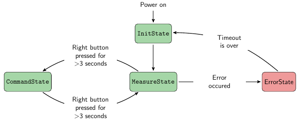
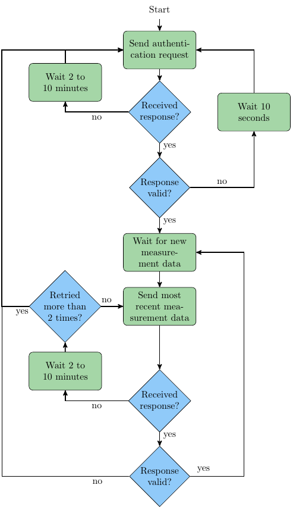
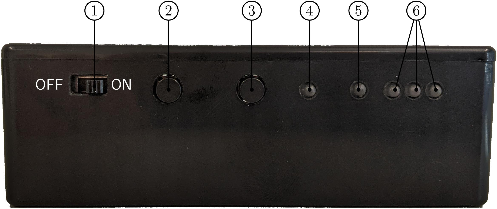
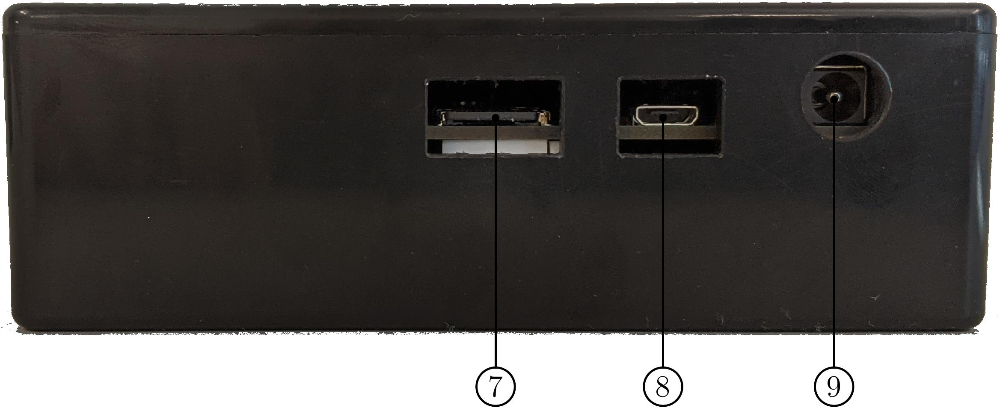
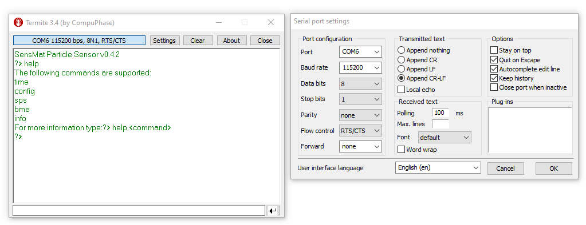

SensMat Particle Sensor <!-- omit in toc -->
=======================

- [Description](#description)
  - [Features](#features)
  - [Documentation](#documentation)
  - [Program Flow Chart](#program-flow-chart)
- [Usage](#usage)
  - [Interfaces](#interfaces)
  - [Starting the sensor](#starting-the-sensor)
  - [Charging the sensor](#charging-the-sensor)
  - [SD card logging](#sd-card-logging)
  - [USB serial command interface](#usb-serial-command-interface)
    - [Supported commands](#supported-commands)
      - [help](#help)
      - [time](#time)
      - [config](#config)
      - [sps](#sps)
      - [bme](#bme)
      - [info](#info)
    - [RTC Calibration and Settings](#rtc-calibration-and-settings)
- [Development](#development)
  - [Preparations](#preparations)
  - [Toolchain](#toolchain)
    - [Option 1: mbed-cli (tested on Linux)](#option-1-mbed-cli-tested-on-linux)
      - [Building](#building)
      - [Flashing](#flashing)
    - [Option 2: SW4STM32 (Eclipse with build tools, tested on Windows)](#option-2-sw4stm32-eclipse-with-build-tools-tested-on-windows)
  - [Libraries](#libraries)
- [Known Problems](#known-problems)
- [Deployed Particle Sensors](#deployed-particle-sensors)


# Description
This is the documentation for the SensMat Particle Sensor software, which runs on the STM32L476RGT6 microcontroller.

## Features
- Particulate matter measurement using the [Sensirion SensorSPS30](https://www.sensirion.com/en/environmental-sensors/particulate-matter-sensors-pm25/) sensor
- Ambient temperature, relative humidity and pressure measurement using the [Bosch Sensortec SensorBME280](https://www.bosch-sensortec.com/products/environmental-sensors/humidity-sensors-bme280/) sensor
- Battery operated (operation time depending on measurement frequency: More than 2 months at a measurement interval of 15 minutes)
- On-board battery charger
- Logging of measurement data to micro SD card
- LoRa module to upload data via Smartmote gateway to SensMat cloud
- USB serial interface for configuration and calibration

## Documentation
The source code documentation can be built with [doxygen](https://www.doxygen.nl/index.html) by executing `doxygen Doxyfile` in the folder `SensMat/Software/Particle_Sensor`. This will create the html documentation in the folder `SensMat/Software/Particle_Sensor/doc/html/`.

To create a PDF file from the LaTeX sources the program `pdflatex` is needed. Then execute `make` in `SensMat/Software/Particle_Sensor/doc/latex/` which compiles the documentation to a PDF named `refman.pdf`.

## Program Flow Chart
The application uses two threads. The main thread implements a simple state machine with four states and the following transitions:
@image latex doc/resources/state_machine_flow_chart.png


In a second thread, which is started in the InitState of the main thread, the LoRa communication is handled accoring to the protocol specification from SensMat:
@image latex doc/resources/lora_thread_flow_chart.png


# Usage
> _**NOTE:**_  
> The device is not waterproof and should therefore only be placed indoors or at a weatherproof location. Placing it in direct sunlight can lead to measurement deviations due to the black enclosure.

## Interfaces
@image latex doc/resources/Sensor_Front_Numbers.jpeg


@image latex doc/resources/Sensor_Back_Numbers.jpeg


1. **Power switch** to turn the power supply on and off
2. **Button** to manually start a single measurement
3. **Button** to display the status and battery charge level for 3 seconds
4. **Status LED** indicating the status of the program (green => no error, red => error)
5. **Charge LED** which indicates if the battery is charging or not
6. **Battery level LEDs** indicating the battery status
7. **SD card slot** for a micro SD card to store measurement data and log data 
8. **Micro USB connector** to configure the particle sensor using a PC
9. **Power connector** to connect the power adapter (9-22V) to for battery charging

## Starting the sensor
1. Make sure that the gateway is running.
2. Switch on the power supply by setting the power switch to ON (to the right).
3. The status LED lights up orange for a while during the start-up process.
4. As soon as the status LED turns green for 3 seconds, the sensor starts reporting measurement data.
5. Optional: By pressing the right button, the status of the sensor (status LED: green => no error; red => error) and the battery level (all battery LEDs green => full; all LEDs off => low/empty) are shown for 3 seconds.
6. Optional: By pressing the left button, a single measurement can be started.

## Charging the sensor
1. Switch off the power by setting the power switch to OFF (to the left).
2. Connect the power adapter to the power connector. The charging process will start immediately.
3. While charging, the charge LED is orange. The charging time is  approximately 3 hours.
4. As soon as the charge LED turns off, the battery is fully charged and the power adapter can be unplugged and the sensor can be started again.

## SD card logging
If logging of measurment data is enabled in the configuration, the raw measurements are stored as CSV file on the microSD card. Every 24 hours, a new file is created.

At each start of the partcle sensor, a log file is created which logs events from the application according to the configured log level. This file should help to debug the firmware.

## USB serial command interface
The USB interface can be used to configure several parameters of the particle sensor, to set and calibrate the RTC, to read version numbers or to test the sensors.

To access it, the following steps are necessary:
1. Turn on the particle sensor and wait until the status LED is green or off.
2. Press the right button (status button) for more than 3 seconds.
3. After releasing the button, the status LED is orange, indicating that the particle sensor is in the command state.
4. Connect the particle sensor with a micro USB cable to a PC.
5. Open a serial terminal (e.g. [Termite](https://www.compuphase.com/software_termite.htm)) at the PC and connect to the right port. The settings for the serial connection are visible in the screenshot below these steps.
6. You should receive something like `SensMat Particle Sensor v0.4.2` and in the following line `?> `, as shown in the figure below.
7. Send `help` to see the supported commands and `help <command name>` to see the usage information for a specific command.
8. To conveniently execute multiple commands in a sequence, the python script `scripts/configure.py` may help.

@image latex doc/resources/Termite_settings.png


### Supported commands
In the following, all supported commands are listed, including a description how to use them. 

#### help
This command prints all supported commands in a list. To view the command description for a specific command, type: `help <command name>`.
E.g. for the `time`-command: `help time`

#### time
```
Usage: time [OPTIONS]
Options:
    <none>                      Print current time
    set YYYY-MM-DD HH:MM:SS     Set time in specified format
    tick <num_ticks>            Print for <num_ticks> seconds every time, the RTC second counter toggles,
                                the amount of passed seconds. Used to measure RTC time drift.
    calibrate <milliseconds>    Calibrate the RTC by sending the time drift per day in milliseconds
```

#### config
```
Usage: config [OPTIONS]
Options:
    <none>          Print current configuration
    <name>=<value>  Set the configuration parameter <name> to the given <value>.
                    Multiple parameters can be set in one command by seperating key-value-pairs with spaces.
```

#### sps
```
Usage: sps COMMAND
Commands:
    on          Enable SPS30 power supply
    off         Disable SPS30 power supply
    probe       Perform probe, to check if SPS30 is responding
    serial      Print serial number
    version     Print version numbers for firmware, SHDLC and hardware
    start       Start measurement procedure
    stop        Stop measurement procedure
    read        Read measurement values from sensor
    clean       Start fan cleaning (only works after "sps start")
```

#### bme
```
Usage: bme COMMAND
Commands:
    init    Initialize SensorBME280
    read    Read measurement values from sensor
```

#### info
```
Usage: info
Print software version and UUIDs
```

### RTC Calibration and Settings
The time can be set manually via the USB serial interface using the `time` command.  
But it is more convenient to do it by using the python script `scripts/rtc_tool.py`, which can set the RTC to the current date and time.
`rtc_tool.py` can also calibrate the RTC to be more accurate.

# Development
The software is based on [Arm Mbed OS 6](https://os.mbed.com/), which is a RTOS for embedded systems and it includes many drivers and stacks.

For building and configurint this Arm Mbed OS project, the code management tool mbed-cli is used.

## Preparations
- For this project, [git](https://git-scm.com/) is used as version control system (VCS), which needs to be installed.

- To use the software, clone the SensMat repository from git.tugraz.at:  
`git clone ssh://git@git.tugraz.at/SensMat.git`

- Change into the directory of the Particle Sensor Software:  
`cd SensMat/Software/Particle_Sensor`

- Since mbed-os and other libraries are included as git submodules in the repository, it is necessary to download (update) the submodules:  
`git submodule update --init --recursive`

- Check if the Arm Mbed OS version in the submodule mbed-os is 6.4.0 or higher by typing:  
`git submodule`
which will print something like:  
`8ef0a435b2356f8159dea8e427b2935d177309f8 mbed-os (mbed-os-6.4.0)`

- If another version is shown, check out version 6.4.0 with
`git checkout mbed-os-6.4.0` in the folder `Software/Framework/mbed-os`

- In the projects root folder, a git patch (`mbed-os.patch`) for the mbed-os submodule is included, which should be applied with `git apply ../../Particle_Sensor/mbed-os.patch` in the folder `Software/Framework/mbed-os`.
This patch applies the following changes:
  1) It increases the default stack size for the LoRa driver thread from 1024 bytes to 4096 in file SX126X_LoRaRadio.cpp line 111. This is necessary, because 1024 is sometimes too little, leading to a crash of the firmware.
  2) Add a `.mbedignore` file to the mbed-os folder to ignore unused modules when compiling with the `mbed` command. This leads to a faster build process.

## Toolchain
There are multiple options how to develop build and flash the firmware. In the following two possible toolchain options are explained.

### Option 1: mbed-cli (tested on Linux)
Needed tools:
- [mbed-cli](https://os.mbed.com/docs/mbed-os/latest/quick-start/build-with-mbed-cli.html): The build system for mbed OS projects.
- [GNU Arm Embedded Toolchain](https://developer.arm.com/tools-and-software/open-source-software/developer-tools/gnu-toolchain/gnu-rm/downloads)
- (Optional) [stlink](https://github.com/stlink-org/stlink): Tool to flash ST microcontrollers
- openocd or pyocd (only for debugging)

Setting the toolchain path is done with:  
`mbed config -G GCC_ARM_PATH /usr/bin/arm-none-eabi-gcc`

#### Building
To build the project for the particle sensor hardware for PCB version 2 using the release profile, execute:  
`mbed compile --profile release --source . --source ../Framework/mbed-os`  
It could be necessary to install further python dependencies with:  
`sudo pip3 install -r ../Framework/mbed-os/requirements.txt`

To change the toolchain, the toolchain path or the target, edit the `.mbed` file.

#### Flashing
When using a Nucleo board to flash the firmware, just copy the created binary file `BUILD/PART_SENS_V3/GCC_ARM-RELEASE/Particle_Sensor.bin` to the storage device emulated by the Nucleo board.

To flash the binary with stlink use:  
`st-flash write ./BUILD/PART_SENS_V3/GCC_ARM-RELEASE/Particle_Sensor.bin 0x8000000`

### Option 2: SW4STM32 (Eclipse with build tools, tested on Windows)
With the mbed-cli tool, a Makefile was exported which allows to compile the project with the `make` tool or with an Eclipse IDE with C/C++ support and the necessary GNU ARM Embedded toolchain installed. System Workbench for STM32 (SW4STM32) is a version of eclipse with all necessary tools included.

> _**NOTE:**_  
> The Makefile includes the configuration for the release build.
> For a debug build with debug symbols, the Makefile needs to be adapted. 

- Install [SW4STM32](https://www.openstm32.org/System%2BWorkbench%2Bfor%2BSTM32)
- Open SW4STM32 and open project folder with `File` -> `Open Projects from File System...` and select folder `Particle_Sensor` from the SensMat repository.
- Maybe it is necessary to add the locations of the `make` and the GNU ARM Embedded toolchain to the system path.
- To build the project, press the hammer symbol
- To debug the project, press the arrow next to the debug symbol (bug) and select `Debug Configurations...`
- In this window, uncollapse the `Ac STM32 Debugging` configurations and select the configuration `Particle_Sensor Debug`
- Connect the debugger (e.g. the one included on a Nucleo board) to the Particle Sensor 6-pin SWD header. With a USB cable connect the debugger to the PC.
- Then press the `Debug` button. This will build the binary, if not already done, flash the binary, start the debugger and switch eclipse into the debug perspective.

## Libraries
For the two sensors, the manufacturers provide drivers, which were included in the `lib` folder of the project. For reference, this are the git repositories, where the libraries are from:
- [Sensirion SensorSPS30 UART driver](https://github.com/Sensirion/embedded-uart-sps)
- [Bosch Sensortec SensorBME280 driver](https://github.com/BoschSensortec/BME280_driver)

## Stack, Heap and CPU statistics
If `PRINT_STATS` is defined, statistics about stack, heap and CPU usage is printed
via the UART interface if the status button is pressed. This can be used to debug 
power management (deep sleep/sleep/run durations) or memory leakage problems.

> _**NOTE:**_  
> The microcontroller only goes in deep sleep mode if the firmware is compiled with the **release** profile.

# Known Problems
- Communication over the USB serial interface does not work reliably when compiling in debug profile (at least on Linux). This is caused by using a while-loop in the receive interrupt handler instead of an if-statement when polling for available characters. But if an if-statement is used, the USB serial interface does not work on Windows.
- If the microcontroller is in deep sleep mode when it is flashed with a new firmware using st-flash, it only erases
 the flash memory but writing the new firmware will fail. Just reconnect the debugger from the PC and flash again
 . Another solution is to switch sensor node into command state, as in this state the microcontroller is not in deep
  sleep mode.

# Deployed Particle Sensors
| PCB # | HWUUID     | SPS30 Serial #   |
|-------|------------|------------------|
|  1    | 0x274784d6 | 15E099066D0D420B |
|  2    | 0xbe90f3bf | 6F5BAC226EB9E8CE |
|  3    | 0xb2881e43 | AFD8C4D630E0E33E |
|  4    | 0x73eba155 | FD1922CB58117D02 |
|  5    | 0xbd69061e | 00941E593F1072DE |
|  6    | 0x7e8af484 | FF3297200FEEBA54 |
|  7    | 0x92b16a1b | C498FD7969A0A47B |
|  8    | 0x95444f80 | 244063AEB5C5B31E |
|  9    | 0xbb1a5576 | 7D6E454FFCFF64BB |
| 10    | 0x5b392615 | C903D98B57446B25 |
| 11    | 0x9442d23b | 4484E7F7A263A28F |
| 12    | 0xe7d0d0f1 | AB41F5B2330B0ECB |
| 13    | 0xb208f50b | BA5D484176C95811 |
| 14    | 0xe6d64d4a | 934B87913FD5D3F2 |
| 15    | 0xc09c6a7a | E9DEFAD71B7FAF3F |
| 16    | 0xc59627fb | 9BC4514C922B18F5 |
| 17    | 0xe0da3bb4 | 98F9290B17B584E9 |
| 18    | 0x9744e944 | DE685F7756526A66 |
| 19    | 0x0ee103ef | 3D0EBA6AC17D82AF |
| 20    | 0x7c759c9e | E7D536CB98CF8EA6 |
| 21    | 0x640cfe8a | 6077E177E4EB78CC |
| 22    | 0x2de283d9 | 07D563C944A1CE29 |
| 23    | 0x35316342 | CEDFFF0110924553 |
| 24    | 0xe56c526c | 8742721F9C4035F5 |


